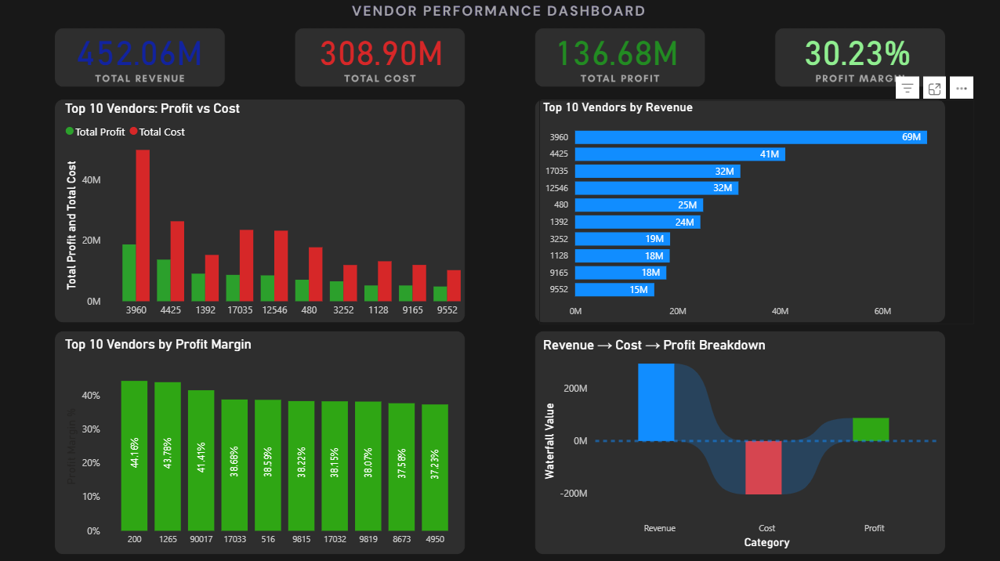

# 📊 Vendor Performance Analysis

---

## 🚀 Project Overview

This project analyzes vendor performance using sales, purchase, and inventory data to uncover insights that improve profitability and decision-making.

The project follows a complete data analytics pipeline:
**SQL → Python → Power BI**

---

## 🎯 Business Problem

Organizations work with multiple vendors, but not all contribute equally to revenue and profit.

Key challenges:

- Identify top-performing vendors
- Detect loss-making vendors/products
- Understand cost and profitability impact

---

## 🛠️ Tools & Technologies

- **SQL (MySQL)** → Data extraction & joins
- **Python (Pandas)** → Data cleaning & validation
- **Power BI** → Dashboard & visualization

---

## 📂 Data Source

Due to GitHub file size limitations, raw datasets are hosted on Google Drive:

👉 **Download Data:**  
https://drive.google.com/drive/folders/1cRptR1j5f0j26V8KkdGGt9uIKGr2GChx?usp=sharing

---

## 📁 Project Structure

Vendor-Performance-Analysis/
│
├── dashboard/
│ └── vendor_dashboard.pbix # Power BI dashboard
│
├── data/
│ ├── raw/ # Raw datasets (Google Drive)
│ └── processed/ # Cleaned datasets
│
├── images/
│ └── dashboard.png # Dashboard preview
│
├── notebooks/
│ └── data_processing.ipynb # Python analysis & validation
│
├── reports/
│ ├── Vendor_Performance_Report.pdf
│ └── Vendor_Performance_Dashboard_Presentation.pptx
│
├── sql/
│ └── vendor_analysis.sql # SQL queries
│
├── README.md
└── .gitignore

---

## 🔄 Workflow

1. **Data Collection**

   - Multiple datasets (sales, purchases, inventory)

2. **SQL Analysis**

   - Data extraction
   - Joins and aggregations
   - KPI calculations

3. **Python Processing**

   - Data cleaning
   - Merging datasets
   - KPI validation

4. **Power BI Dashboard**
   - KPI cards (Revenue, Cost, Profit, Margin)
   - Top 10 vendor analysis
   - Profit vs Cost comparison
   - Waterfall (Revenue → Cost → Profit)

---

## 📊 Key Insights

- A small group of vendors contributes most of the revenue
- High costs significantly reduce profitability
- Vendor performance varies across the dataset
- Profit margin remains stable (~30%)

---

## 📈 KPIs Created

- Total Revenue
- Total Cost
- Total Profit
- Profit Margin
- Inventory Turnover

---

## 💡 Business Recommendations

- Focus on high-margin vendors
- Reduce dependency on high-cost vendors
- Optimize procurement strategies
- Improve inventory efficiency

---

## 🧠 Skills Demonstrated

- Data Cleaning & Transformation
- SQL Joins & Aggregation
- Python Data Analysis
- KPI Development
- Dashboard Design (Power BI)

---

## 📊 Dashboard Preview

---

## 📑 Project Presentation

You can view the project presentation here:

📂 **PPT File:**  
reports/Vendor_Performance_Dashboard_Presentation.pptx

This presentation includes:

- Project overview
- Problem statement
- Data analysis process
- Dashboard insights
- Key findings

---

## 📄 Project Report

📂 **Report File:**  
reports/Vendor_Performance_Report.pdf

This report includes:

- Detailed analysis
- SQL & Python workflow
- Dashboard explanation
- Business insights

---

## 📌 Note

> Raw datasets are not included due to GitHub size limits. Use the Google Drive link to access data.

---

## 👨‍💻 Author

**Krishna Bhise**  
Aspiring Data Analyst | SQL • Python • Power BI
